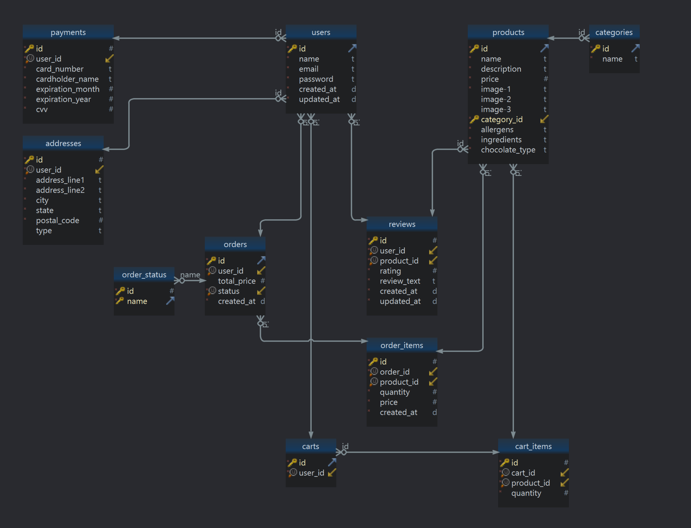
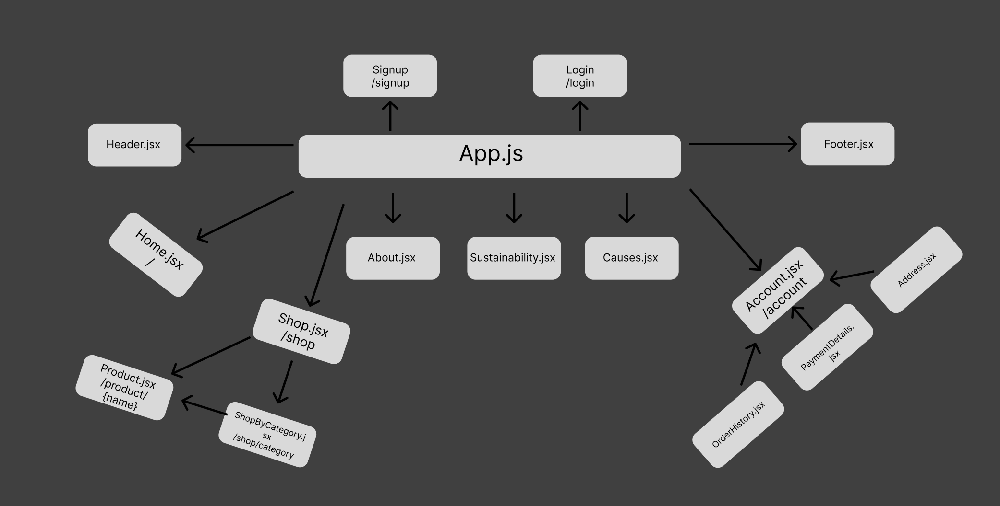
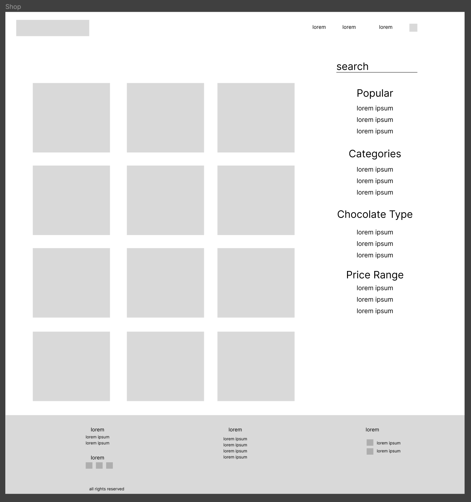
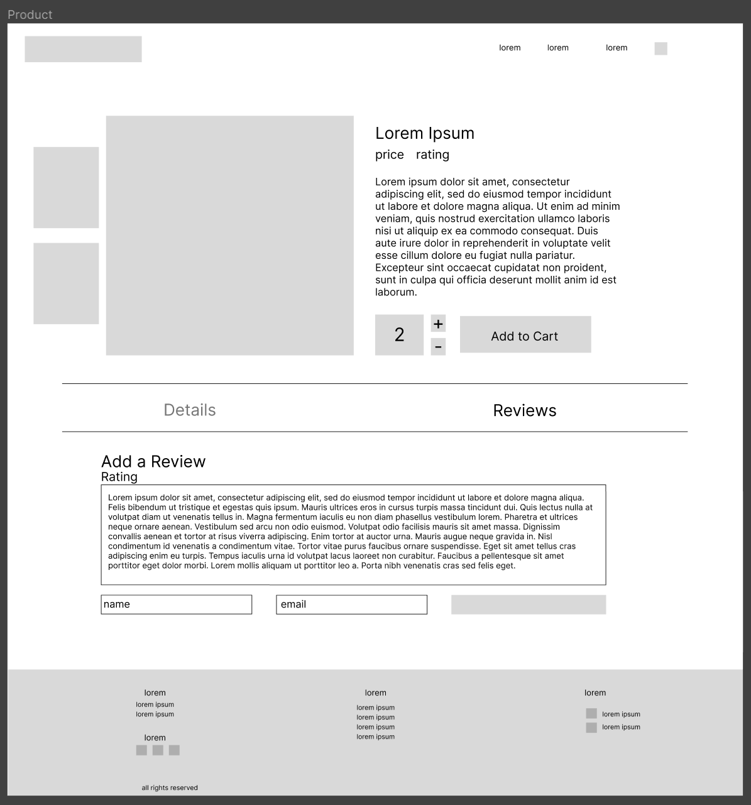
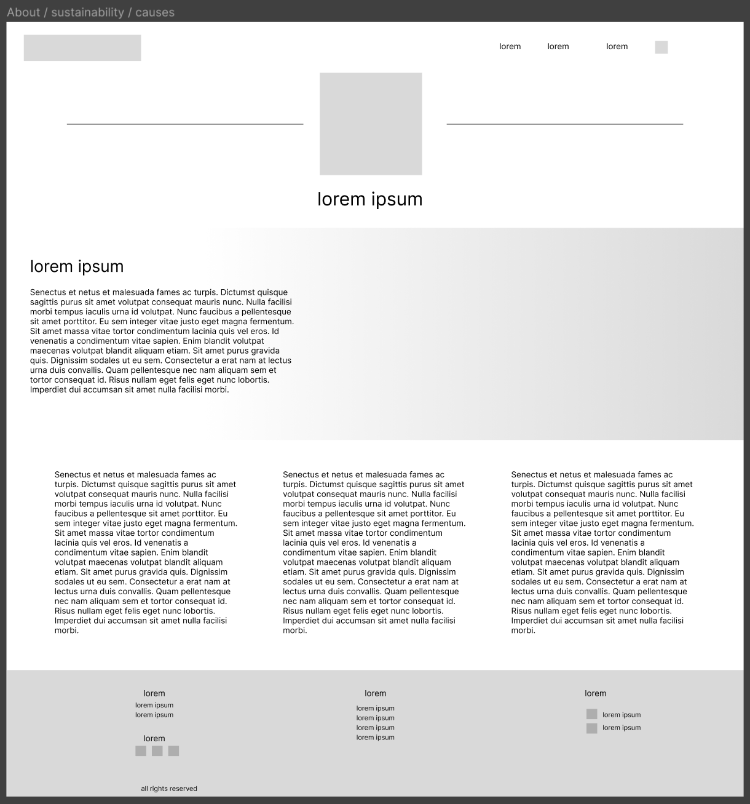

# Chocotonic

Chocotonic is a hypothetical chocolate brand with sustainability and charity at its core. On the site you will be able to view and purchase products as well as view details about the company and its causes.

## User Stories

    1. Users will be able to browse a variety products from different categories
    2. Users can add products they would like to their carts, as well as view and manage their carts
    3. Users can proceed through the checkout process
    4. Users can view their order history and see details of their order / cancel an order
    5. Users can view information about the company on their sustainability goals
    6. Users can leave reviews on products

## Stretch Goals

    1. Interactive product images
    2. Social login integration
    3. Product recommendations

## Models

## API Routes

|      **API Route**      | **Request Method** |                                  **Body**                                  |                                **Response**                                |
| :---------------------: | :----------------: | :------------------------------------------------------------------------: | :------------------------------------------------------------------------: |
|         /signup         |        POST        |                          {name, email, password}                           |                        {id, name, email, password}                         |
|         /login          |        POST        |                             {email, password}                              |         {{"message":"login successful"}, "user": {id,name,email}}          |
|         /logout         |       DELETE       |                                                                            |                     {"message" : "logout successful"}                      |
|        /products        |        GET         |                                                                            |            {{id, name, description, price, ...}, {...}, {...}}             |
|        /products        |       PATCH        |                                 {quantity}                                 |                    {{id, name, description,price,...}}                     |
| /products?category={id} |        GET         |                                                                            |            {{id, name, description, price, ...}, {...}, {...}}             |
|       /users/{id}       |        GET         |                                                                            |                             {id, name, email}                              |
|       /users/{id}       |       PATCH        |                           {"email", "password"}                            |                             {id, name, email}                              |
|       /users/{id}       |       DELETE       |                                                                            |                                     {}                                     |
|    /orders/{user_id}    |        GET         |                                                                            |           {{id, total_price, status, created_at}, {...}, {...}}            |
|    /orders/{user_id}    |       DELETE       |                                                                            |                                     {}                                     |
|    /orders/{user_id}    |       PATCH        |                                 {"status"}                                 |               {id, user_id, total_price, status, created_at}               |
|   /payments/{user_id}   |        GET         |                                                                            | {id, card_number, cardholder_name, expiration_month, expiration_year, cvv} |
|   /payments/{user_id}   |       PATCH        |       {"card_number", "expiration_month", "expiration_year", "cvv"}        | {id, card_number, cardholder_name, expiration_month, expiration_year, cvv} |
|   /payments/{user_id}   |       DELETE       |                                                                            |                                     {}                                     |
|   /adresses/{user_id}   |        GET         |                                                                            |     {id, address_line1, address_line2, city, state, postal_code, type}     |
|  /addresses/{user_id}   |       PATCH        | {"address_line1", "address_line2", "city", "state", "postal_code", "type"} |     {id, address_line1, address_line2, city, state, postal_code, type}     |
|  /addresses/{user_id}   |       DELETE       |                                                                            |                                     {}                                     |
|     /cart/{user_id}     |        GET         |                                                                            |     {id, user_id, "cart_items":{{product_id, quantity}, {...}, {...}}}     |
|       /cart_items       |        POST        |                      {cart_id, product_id, quantity}                       |                    {id, cart_id, product_id, quantity}                     |
|       /cart_items       |       DELETE       |                                                                            |                                     {}                                     |
|  /reviews/{product_id}  |        GET         |                                                                            |   {id, user_id, product_id, rating, review_text, created_at, updated_at}   |
|  /reviews/{product_id}  |        POST        |                 {user_id, product_id, rating, review_text}                 |   {id, user_id, product_id, rating, review_text, created_at, updated_at}   |
|  /reviews/{product_id}  |       PATCH        |                           {rating, review_text}                            |   {id, user_id, product_id, rating, review_text, created_at, updated_at}   |
|  /reviews/{product_id}  |       DELETE       |                                                                            |                                     {}                                     |

 

## React Tree

## Client Routes

| Client Route    | Component          |
| --------------- | ------------------ |
| /               | Home.jsx           |
| /shop           | Shop.jsx           |
| /shop/category  | ShopByCategory.jsx |
| /product/{name} | Product.jsx        |
| /about          | About.jsx          |
| /sustainability | Sustainability.jsx |
| /causes         | Causes.jsx         |
| /account        | Account.jsx        |
| /signup         | Signup.jsx         |
| /signin         | SignIn.jsx         |

## Wireframes

